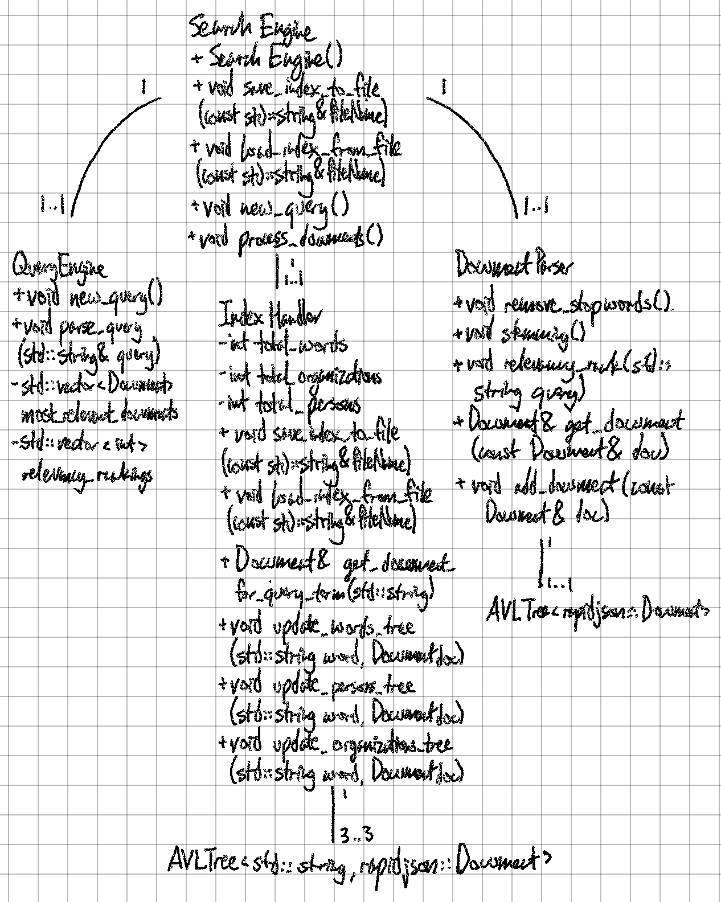

## UML Diagram

## Description of each class and the data structures used 

**Search Engine** 
- Contains the other three classes: Document Parser, Query Engine, and Index Handler
- Calls functions from other classes depending on user input  

**Document Parser** 
- Holds AVL tree with all the documents
- Processes documents by removing stopwords, conducting stemming, and extracting keywords  
- Ranks document relevancy given words from the query  

**Query Engine**
- Take in queries from the user and parses the queries
- Vectors that store most relevant documents and order them based on relevancy ranking   

**Index Handler**
- Three AVL trees that hold indices for words, people, and organizations 
- Tracks number of words, people, and organizations that have been kept in the index 
- Persistence functionality - saving and loading to index to files 

## Description of how classes interact to create index and perform query

**Creating Index**
- Call process_documents() function from the Search engine
- For every file, process it with rapidJSON 
- Add the resulting document into the Document parser's AVL tree with the documents
- For every word, organization, or person in the document - add it to the corresponding AVL tree in the Index handler 

**Performing Query**
- Search engine gets called for new query from main function
- Search engine calls Query engine and parses the query 
- Based on words in the query, gets documents from Index handler that has the words 
- Returns documents and finds document information from the Document parser AVL tree 
- Document parser calculates relevancy ranking for each of the documents 
- Prints 15 most relevant documents
- User chooses document to print out 
- Get document information form Document parser 

 
## Timeline

| Task                      | Planned completion | Actual completion | Time spent in hrs by Miles | Time spent in hrs by Marc |
| -----------------         | :-----------------:| :---------------: | :------------------------: | :-----------------------: |
| Design                    | Mar 31              | Mar 31             | 2                        | 4                         |
| Link the classes           | Apr 4        | Mar 31                       | 0 | 1
| User interface                | Apr 4      |    Mar 31                    | 0 | 1
| Implement AVL tree w/ tests     |Apr 8      | Apr 7              | 8 | 0
| Recursive file/folder traversal | Apr 10  |Apr 15 | 0.5|0
| Document Parser           | Apr 10 |Apr 15|2.5|0
| Persistence            |Apr 10  | Apr 17 | 0 | 3
| Indices                     |Apr 15  |Apr 16|2| 0
| Query processor (w/ relevancy ranking)          |Apr 15  | Apr 20 | 1 | 8
| Fixes and wrap-up           |Apr 22  | Apr 26 | 9.5|8
| Bonus work                  |Apr 22  | Apr 24 | 2 |2
| Documentation    |Apr 24  |   Apr 24    |      1.5  |2
| Final project     | Apr 25|    |     | 

## Notes 
NEED:
- number of times each word appears in each document
- number of documents total 
- number of documents that contain each word 
- ability to print each document's info - title, text, etc.
- adding documents to document AVL tree (for printing)
- A lot of break days for our mental sanity.

(tree in QueryEngine with each document's frequency)

When processing documents:
- Add doucument info to the Document Tree
- Add words/person/org to the respective Index trees (updating frequencies)

When processing queries:
- For each doc that contains the word, calculate tf-idf statistic and store in tree
- Multiple terms: calculate sum/average of the statistic for each document (new tree?)
- Excluding words: find docs that contain that word, and remove from the tree 
- Search for Top 15 
- Print info using the id to search the Document Tree

Calculating statistic:

   [ (# of docs that contain the word / total # of docs) * frequency of the word in the doc ]
    frequency of the word in the doc / # of docs that contain the word
