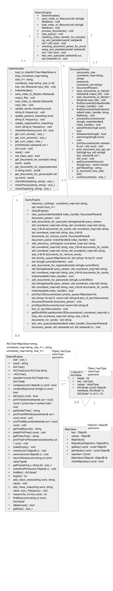

# UML Diagram 



# High-Level Pseudocode 

```markdown
main()
{
    Initialize the Search Engine.
    Ask the user whether they want to…
        a) Create the index
        b) Load the persistence file
        c) Save into the persistence file
        d) Make a query
        e) Terminate the program
    Takes in the user’s input.
    Depending on the user’s input, the program will perform one of the 5 operations listed above.
    Start the timer tracking how long the operation will take.
    Ends the timer tracking how long the operation will take.
    Prints out how long the operation took.
    Keeps asking the user for a new prompt until the user decides to quit.
}
```

```markdown
Search Engine 
    save_index_to_file
    {
        Open output file
        Save index to file 
        Save documents to file
        Close output file
    }
    load_index_to-file
    {
        Open input file
        Check if file was successfully opened
        Load index to file
        Load documents to file
        Close input file 
    }
    process_documents
    {
        Start timer
        Go through documents 
        End timer
        Calculate stats
    }
    new_query
    {
        Start new query
        Calculate stats
    }
```

```markdown
DocumentParser
    document_parser
    {
        Open stopwords file
        For every word, insert it into the stopwords unordered_set
    }
    save_documents_to_file
    {
        For every key-value pair in documents_tree
        Add the key-value pair to the output file
    }
    load_documents_to_file 
    {
        Clear the document tree
        For every line in the input file	
        Add the information to the document tree
    }
    findDocuments
    {
        Recursively traverse through data folders
        Call processDocument() for every .json file
    }
    processDocuments
    {
        Open the file and set up parsing for .json
        Get the id
        Get the text
        For every word:
            Check if it is a valid string
            Convert to lowercase
            Check if it is a stopword
            Stem
            Add to the words tree along with the doc id
        Get the persons and add to the persons tree
        Get the orgs and add to the orgs tree
        Add the doc id and filename to the documents tree
        Close input file 
    }
    parseWord
    {
        Convert to lowercase
        Check if it is a stopword
        If not stopword, stem and return the stemmed word 
    }
    isStopword
    {
        Check if the word is in the unordered_set of stopwords 
    }
    stemming
    {
        Call Porter2Stemmer trim and stem
    }
    printDocuments
    {
        For every doc in the documents tree:
        Print out the id and title 
    }
    print_document_and_get_text
    {
        Get the filename of the document
        Parse the .json file
        Print the title, publication, and date published 
    }
    get_document_info 
    {
        Get the filename of the document
        Parse the .json file
        Get the title, author, date published, and text
        Store and return in a vector along with the filename
    }
    get_title
    {
        Return the document title 
    }
```

```markdown
IndexHandler
	load_to_tree 
	{
		For every word in the input file:
			Get document name and frequency for each doc
			Create a new node and insert it into the tree
	}
	save_index_to_file 
	{
		Save each tree (words, persons, orgs) to the output file 
	}
	load_index_to_file
	{
		For each tree (words, persons, orgs):
			Make it empty
			Load info from the input file into the tree
	}
	update_words_tree 
    {
        If the word is already in the tree, update it with the new doc/frequency
        If the word is not in the tree, create a new node to insert it with the current doc 
    }
    checkWord
    {
        Check if the appropriate tree (words, persons, org) contains the search term
    }
    update_persons_tree
    {
    If the person is already in the tree, update it with the new doc/frequency
        If the person is not in the tree, create a new node to insert it with the current doc 
    }
    update_organizations_tree
    {
    If the org is already in the tree, update it with the new doc/frequency
        If the org is not in the tree, create a new node to insert it with the current doc 
    }
    get_num_words
    {
        Return the size of the words_tree
    }
    get_num_persons 
    {
        Return the size of the persons_tree
    }
    get_num_orgs
    {
        Return the size of the orgs_tree
    }
    reset
    {
        Make each of the three trees (words, persons, orgs) empty
    }
    checkWords
    {
        Return the frequency of the word in the given doc 
    }
    checkPerson
    {
            Return the frequency of the person in the given doc 
        }
    checkOrg
    {
        Return the frequency of the org in the given doc 
    }

```
```markdown
QueryEngine
    new_query() 
    {
        Check if the index handler and document parser are properly set up for a query.
        Ask the user to input a query and continue to ask if no query has been inputted.
        Clear the data from the previous query.
        For each word, organization, person, or remove word (words that the user wants to remove from the query), get the documents that the specified term appears in from the index handler.
        Completed with add_documents_for_query().
        Find which specified term appears in the least number of documents.
        Let this specified term be referred to as the Specified Key.
        Completed with getWordWithLeastNumberOfDocuments().
        For each document that the Specified Key appears in, calculate the relevancy ranking for that document for all the query words given.
        Insert the document and its relevance ranking into the top15 minimum heap if there are less than 15 documents already in the heap or if its relevance ranking is higher than the lowest relevance ranking on the heap.
        Completed by add_relevancy_ranking.
        If there are no relevant documents with all the query terms, print out that there were no documents found.
        Print out the documents from most relevant to least relevant. from the top15 minimum heap.
        Completed by printTop15Documents().
        Prompt the user to choose a document to print out and print out its text.
    }
    add_documents_for_query() 
    {
        For every word in the query:
        If the word starts with - and the word is not a stopword, then get the documents that the word appears in.
        These documents will be removed later on from the final result.
        If the word starts with ORG:, then get the documents that the organization appears in.
        Completed by add_documents_for_organization().
        If the word starts with PERSON:, then get the documents that the person appears in.
        Completed by add_documents_for_person().
        Otherwise, the current word is a normal word.
        Parse the word and go to the next word if the current word is a stopword.
        If the current word is not in the index handler’s word tree, then print out that no documents have been found and stop the query.
        If it has been found, get the documents that the word appears in.
    }
    add_relevancy_ranking()
    {
        This function is given a document, and it finds the relevance ranking for that document.
        The function is also given a minimum heap top15, which holds the 15 most relevant documents.
        For every word, organization, and person in the query.
        If the search term appears in the document, add the frequency of that search term in the document to the relevancy ranking.
        Otherwise, stop calculating the relevance ranking for that document and skip it.
        For all words that the user wants to remove from the query:
        If the search term appears in the document, stop calculating the relevance ranking for that document and skip it.
        If there are less than 15 documents in top15, then add the current document and its relevance ranking score to the heap.
        If there are 15 documents in top15 but the current document has a higher relevance ranking than the 15th most relevant document, remove the 15th most relevant document and add the current document.
    }
    add_documents_for_organization()
    {
        Remove the ORG: at the beginning of the search term.
        Find the remainder of the organization search term, which are separated by spaces.
        Keep searching until a PERSON: label is reached or the end of the query is reached.
        If a PERSON: label is reached, get the documents that have the person search term in them.
        Get the documents that the full organization search term is in.
        If there are no such documents, stop the query.
    }
    add_documents_for_person()
    {
        Remove the PERSON: at the beginning of the search term.
        Find the remainder of the person search term, which might be separated by spaces.
        Keep searching until an ORG: label is reached or the end of the query is reached.
        If an ORG: label is reached, get the documents that have the person search term in them.
        Get the documents that the full person search term is in.
        If there are no such documents, stop the query.
    }
    printTop15Documents()
    {
        The function is given a minimum heap that has the 15 most relevant documents for the query.
        Keep popping off documents from the heap and storing the document’s ID into a vector starting from the back of the vector.
        The beginning of the vector will then have the most relevant documents while the end will have the least relevant documents.
        Print out the documents in the vector from beginning to end, or from most relevant to least relevant.
    }
    printSpecificDocument()
    {
        Make the user input the number of the document that they want to open up.
        Continue asking them to input this until it is a valid number.
        Print the document with the number they inputted.
    }
    getWordWithLeastNumberOfDocuments()
    {
        The function is given the unordered_maps for each of the words in the query.
        Going through each of the unordered_maps, the program compares the sizes of the unordered_maps to one another to find the search term in the query that has an unordered_map of the smallest size.
    }
```


# Timeline

| Task                      | Planned completion | Actual completion | Time spent in hrs by Miles | Time spent in hrs by Marc |
| -----------------         | :-----------------:| :---------------: | :------------------------: | :-----------------------: |
| Design                    | Mar 31              | Mar 31             | 2                        | 4                         |
| Link the classes           | Apr 4        | Mar 31                       | 0 | 1
| User interface                | Apr 4      |    Mar 31                    | 0 | 1
| Implement AVL tree w/ tests     |Apr 8      | Apr 7              | 8 | 0
| Recursive file/folder traversal | Apr 10  |Apr 15 | 0.5|0
| Document Parser           | Apr 10 |Apr 15|2.5|0
| Persistence            |Apr 10  | Apr 17 | 0 | 3
| Indices                     |Apr 15  |Apr 16|2| 0
| Query processor (w/ relevancy ranking)          |Apr 15  | Apr 20 | 1 | 8
| Fixes and wrap-up           |Apr 22  | Apr 26 | 9.5|8
| Bonus work                  |Apr 22  | Apr 24 | 2 |2
| Documentation    |Apr 24  |   Apr 24    |      1.5  |2
| Final project     | Apr 25|    |     | 

# Used Data Structures
> For the words, organizations, and persons trees, the program uses an AVL Tree mapping words to an unordered_map<std::string, int>, which maps the IDs of the documents that the word appears in to the frequency that the word appears in the document.  An AVL Tree was appropriate because it allows the program to quickly search for words and their corresponding documents with a worst-case time complexity of O(logN), where N is the number of words in the tree.  The tree also allows the program to insert words into the tree with a time complexity of O(log N), which is useful for initially processing the documents and loading the documents from a file.  An unordered_map<std::string, int> was used for the frequencies because the time complexity of finding a key-value pair is O(1), which would make taking in a new query much faster.  While AVL Trees can order the elements in a specific way and can output those elements in a predictable manner, the document IDs do not need to be ordered in such a way, and the program does not need the document IDs to be outputted in a specific manner (except for testing).  With N1 being the number of words in the AVL Tree and N2 the total number of documents, the worst-case space complexity is O(N1 * N2), where all the words appear in every single document.  Instead of using an AVL Tree, another unordered_map may have been used because it also provides fast search and insertion, and the words do not need to be ordered in any particular way.

> For the Documents, an unordered_map of the document ID to the file name of the document was used.  An unordered_map was used for document IDs because the time complexity of finding a key-value pair is O(1), which would make searching for the filepath of a specific document ID incredibly fast.  Inserting key-value pairs into the unordered_map is also incredibly quick, with a time-complexity of O(1).  Additionally, while the unordered_map does not store its key-value pairs in an ordered fashion, the program does not need to sort the document IDs in any form throughout the program.  The only potential downside is that rehashing the unordered_map may take significant time, but because we know the exact number of documents in the data set, this issue can be avoided.  With N being the total number of documents in the data set, the space complexity is O(N).  Instead of using an unordered_map, an AVL Tree may be used, which has a slower time complexity for search and insertion but avoids the potential issues with rehashing.

> To find the 15 most relevant documents, a minimum heap (std::priority_queue) was used to hold the 15 most relevant documents.  Specifically, in my implementation, a document would only be added to the heap if (1) there are less than 15 documents in the minimum heap or (2) the document has a relevancy ranking higher than the 15th most relevant document.  A minimum heap was used because my implementation required quick access to the minimum of the heap, which has a time complexity of O(1).  Using a minimum heap also allowed the program to quickly insert and remove the document into the heap, both of which have a time complexity of O(log N).  With there only being at most 15 elements in the minimum heap, the space complexity becomes O(1).  Other data structures that could have been used is the vector, which would have less efficient insertions and deletions, and an AVL Tree, which requires more steps to access the minimum of the tree.

> To store the text of the 15 most relevant documents, a vector was used.  In my implementation, the size of the vector is already known from the size of the minimum heap used to hold the 15 most relevant documents, and the program assigns each document a number and prompts the user to choose the number of the document that they want to see the text of.  A vector, when its size is already known, allows for the program to append elements to the vector for a time complexity of O(1) without having to resize the vector, which may take a long time.  A vector also allows the program to access elements in the vector with a speed of O(1) when the index of the element is already known.  With there being at most 15 elements in the vector, the space complexity becomes O(1).  Other data structures that could have been used is an unordered_map, which also has O(1) time complexity for accessing elements and inserting elements, and an array since the size of the list is known beforehand.

# User Documentation
- How to use the software.
> Run the program from the terminal, typing in the folder containing all the search files after the executable (e.g. "./a.out test_data")
     Upon starting the program, choose one of the 5 options: \
        1) Create the index\
        2) Load the persistence file\
        3) Save into the persistence file\
        4) Make a query\
        5) Terminate the program\
    To start a query, create an index or load a previously saved index.\
    When entering the query, use all caps and a colon when searching for people and organizations.\
    After the query search is completed, enter a number that corresponds with the document that you want to open.\

- Some example queries with the results.
    - markets
        - Document 1: Philip Morris International Inc. (PMI) Reports 2017 Results; Excluding Currency & Tax Items, Full-Year 2017 Adjusted Diluted EPS Growth of 10%; Provides 2018 Earnings Per Share Forecast
            - Publication: cnbc.com
            - Date Published: 2018-02-08T14:59:00.000+02:00
        - Document 2: Global Hospital Information Systems (HIS) Industry
            Publication: cnbc.com
            Date Published: 2018-03-20T21:31:00.000+02:00
        - Document 3: Philip Morris International Inc. (PMI) Reports First- Results; Increases, Primarily to Reflect a Lower Effective Tax Rate, 2018 Full-Year Reported Diluted EPS
            - Publication: cnbc.com
            - Date Published: 2018-04-19T14:59:00.000+03:00
        - Document 4: Sun Life Financial Reports Fourth Quarter and Full Year 2017 Results
            - Publication: cnbc.com
            - Date Published: 2018-02-15T01:04:00.000+02:00
        - Document 5: Sun Life Financial Reports First Quarter 2018 Results
            - Publication: cnbc.com
            - Date Published: 2018-05-09T01:06:00.000+03:00
        - Document 6: USAT Announces Broad Availability of Newly Acquired Seed Markets Software
            - Publication: cnbc.com
            - Date Published: 2018-02-22T16:15:00.000+02:00
        - Document 7: Celestica Announces Fourth Quarter and Full Year 2017 Financial Results
            - Publication: cnbc.com
            - Date Published: 2018-01-25T00:16:00.000+02:00
        - Document 8: Euronext Publishes Full Year 2017 Results
            - Publication: cnbc.com
            - Date Published: 2018-02-19T09:20:00.000+02:00
        - Document 9: Daimler posts record results once again: unit sales, revenue and EBIT at new highs - higher dividend of €3.65 proposed
            - Publication: cnbc.com
            - Date Published: 2018-02-01T10:08:00.000+02:00
        - Document 10: Clear Channel Outdoor Holdings, Inc. Reports Results for 2017 Fourth Quarter and Full Year
            - Publication: cnbc.com
            - Date Published: 2018-05-01T00:34:00.000+03:00
        - Document 11: Nasdaq Reports First Quarter 2018 Results; Delivers Strong Growth in Revenues and Income
            - Publication: cnbc.com
            - Date Published: 2018-04-25T14:45:00.000+03:00
        - Document 12: Sea Limited Reports Fourth Quarter and Full Year 2017 Results
            - Publication: cnbc.com
            - Date Published: 2018-02-28T02:00:00.000+02:00
        - Document 13: Sea Limited Reports Fourth Quarter and Full Year 2017 Results
            - Publication: cnbc.com
            - Date Published: 2018-02-28T02:00:00.000+02:00
        - Document 14: Peyto Posts 18th Consecutive Year of Profits, Earnings Per Share Up 55%
            - Publication: cnbc.com
            - Date Published: 2018-03-01T03:52:00.000+02:00
        - Document 15: CNBC Interview with Nasdaq CEO, Adena Friedman, from the World Economic Forum 2018
            - Publication: cnbc.com
            - Date Published: 2018-01-23T08:00:00.000+02:00
    - social network
        - Document 1: Scripps Networks Interactive reports full year and fourth quarter 2017 operating results
            - Publication: cnbc.com
            - Date Published: 2018-02-27T00:01:00.000+02:00
        - Document 2: The Lucrative Business of Fake Social Media Accounts
            - Publication: Nicholas Confessore
            - Date Published: 2018-01-28T21:07:00.000+02:00
        - Document 3: WWE® Reports Strong Fourth-Quarter Achieving Record Results for 2017
            - Publication: cnbc.com
            - Date Published: 2018-02-08T16:30:00.000+02:00
        - Document 4: Extreme Networks Reports Third Fiscal Year 2018 Financial
            - Publication: cnbc.com
            - Date Published: 2018-05-09T00:05:00.000+03:00
        - Document 5: Alibaba Group Announces March Quarter 2018 Results and Full Fiscal Year 2018 Results
            - Publication: cnbc.com
            - Date Published: 2018-05-04T15:24:00.000+03:00
        - Document 6: Juniper Networks Reports Preliminary 2018 Financial Results
            - Publication: cnbc.com
            - Date Published: 2018-05-02T00:15:00.000+03:00
        - Document 7: Extreme Networks Reports Second Quarter Fiscal Year 2018 Financial Results
            - Publication: cnbc.com
            - Date Published: 2018-02-07T00:05:00.000+02:00
        - Document 8: Juniper Networks Reports Preliminary Fourth and Fiscal Year 2017 Financial Results
            - Publication: cnbc.com
            - Date Published: 2018-01-31T00:15:00.000+02:00
        - Document 9: T-Mobile Reports Record Financial Results Across the Board for FY 2017, Issues Strong Guidance for 2018 and Beyond
            - Publication: cnbc.com
            - Date Published: 2018-02-08T14:00:00.000+02:00
        - Document 10: IIJ Announces Nine Months Financial Results for the Fiscal Year Ending March 31, 2018
            - Publication: cnbc.com
            - Date Published: 2018-02-08T06:06:00.000+02:00
        - Document 11: iPass Reports First Financial Results
            - Publication: cnbc.com
            - Date Published: 2018-05-09T00:05:00.000+03:00
        - Document 12: Juniper Networks Announces Increased Quarterly Cash Dividend and Expansion of Capital Return Plan
            - Publication: cnbc.com
            - Date Published: 2018-01-31T00:15:00.000+02:00
        - Document 13: Could chocolate brownies boost U.S. businesses seeking to do good?
            - Publication: Reuters Editorial
            - Date Published: 2018-03-26T19:25:00.000+03:00
        - Document 14: WWE® Network Hits Record 2.1 Million Subscribers
            - Publication: cnbc.com
            - Date Published: 2018-04-09T23:45:00.000+03:00
        - Document 15: T-Mobile Celebrates 5 Years as a Public Company with Record-Low Churn, Industry-Leading Customer Growth, and Strong Profitability
            - Publication: cnbc.com
            - Date Published: 2018-05-02T00:05:00.000+03:00
    - social network PERSON:cramer
        - Document 1: Cramer: Facebook's Zuckerberg, Sandberg can't watch over data leak
            - Publication: Berkeley Lovelace Jr.
            - Date Published: 2018-03-22T16:46:00.000+02:00
        - Document 2: Cramer: Facebook needs to show it has nothing to hide
            - Publication: Berkeley Lovelace Jr.
            - Date Published: 2018-03-27T18:52:00.000+03:00
        - Document 3: Cramer: How Facebook's drop compares to other scandal-ridden stocks like Chipotle
            - Publication: 
            - Date Published: 2018-03-29T01:35:00.000+03:00
        - Document 4: Cramer: Tim Cook's comments show knives are out for Facebook after leak
            - Publication: Berkeley Lovelace Jr.
            - Date Published: 2018-03-29T19:24:00.000+03:00
        - Document 5: Cramer Remix: Boeing is a better bet than bitcoin
            - Publication: 
            - Date Published: 2018-01-12T01:59:00.000+02:00
        - Document 6: Cramer trust sells some Facebook shares after social data controversy
            - Publication: Berkeley Lovelace Jr.
            - Date Published: 2018-03-19T16:38:00.000+02:00
        - Document 7: Cramer Remix: My advice for Lloyd Blankfein on cryptocurrencies
            - Publication: 
            - Date Published: 2018-01-20T01:59:00.000+02:00
        - Document 8: Cramer: Facebook might be the cheapest stock in the S&P 500
            - Publication: Berkeley Lovelace Jr.
            - Date Published: 2018-04-26T03:00:00.000+03:00
        - Document 9: Cramer: Snap's earnings call was like a 'Saturday Night Live' parody
            - Publication: 
            - Date Published: 2018-05-02T18:02:00.000+03:00
        - Document 10: Cramer: Facebook needs internal special prosecutor on data scandal
            - Publication: Berkeley Lovelace Jr.
            - Date Published: 2018-03-21T15:32:00.000+02:00
    - social network ORG:facebook PERSON:cramer
        - Document 1: Cramer: Facebook's Zuckerberg, Sandberg can't watch over data leak
            - Publication: Berkeley Lovelace Jr.
            - Date Published: 2018-03-22T16:46:00.000+02:00
        - Document 2: Cramer: Facebook needs to show it has nothing to hide
            - Publication: Berkeley Lovelace Jr.
            - Date Published: 2018-03-27T18:52:00.000+03:00
        - Document 3: Cramer: Tim Cook's comments show knives are out for Facebook after leak
            - Publication: Berkeley Lovelace Jr.
            - Date Published: 2018-03-29T19:24:00.000+03:00
        - Document 4: Cramer trust sells some Facebook shares after social data controversy
            - Publication: Berkeley Lovelace Jr.
            - Date Published: 2018-03-19T16:38:00.000+02:00
        - Document 5: Cramer: How Facebook's drop compares to other scandal-ridden stocks like Chipotle
            - Publication: 
            - Date Published: 2018-03-29T01:35:00.000+03:00
        - Document 6: Cramer: Facebook might be the cheapest stock in the S&P 500
            - Publication: Berkeley Lovelace Jr.
            - Date Published: 2018-04-26T03:00:00.000+03:00
        - Document 7: Cramer: Facebook needs internal special prosecutor on data scandal
            - Publication: Berkeley Lovelace Jr.
            - Date Published: 2018-03-21T15:32:00.000+02:00
    - facebook meta -profits 
        - Document 1: CMO Today: Comcast Makes Sky Bid; FedEx Continues NRA Partnership; Media Companies Praise Twitter
            - Publication: Lara O’Reilly
            - Date Published: 2018-02-27T16:04:00.000+02:00
        - Document 2: Newest Generation of Leading Heart Stent is Now Approved in the U.S. for People with Coronary Artery Disease
            - Publication: cnbc.com
            - Date Published: 2018-05-23T17:00:00.000+03:00   

# Performance
- Statistics for indexing all documents and timing.

| Action                      | Time using Debug | Time using Release | 
| --------------------------- | :---------------:| :----------------: | 
| Indexing                    | 17 mins          | 11.5 mins          | 
| Save to persistence         | 4 mins           | 4 mins             | 
| Load to persistence         | 2 mins           | 1 min              | 
| New query                   | <1 sec           | <1 sec             | 

# Automatic Tests and Memory Tests
See Tests.cpp file for CATCH2 tests.

# Bonus Work Completed
- Corpus analytics
    - Report indexing speed in documents/second
    - Update the indexing speed every 100 documents
    - Number of words indexed
    - Number of unique words indexed 
    - Print the number of total results that met the search criteria 
- Early submission bonus 
